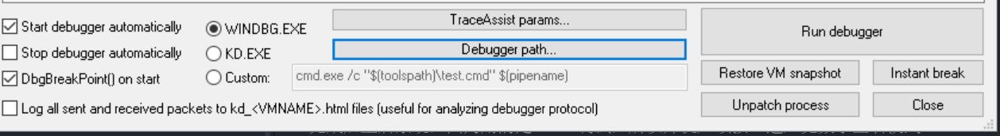

## Preface

一直没有接触windows驱动，这里稍微学习一下

## 配置环境

配置环境一直是很麻烦的事情，后来终于找到一个很方面的方法 
详见[fuzzysecurity kernel exp](http://www.fuzzysecurity.com/tutorials/expDev/14.html) 

主机：Windows10 64bit 
target：Windows10 64bit 
调试工具：windbg64bit

### 安装

首先需要到官网下载visual studio和winsdk 

### 目标机设置

直接安装VirtualKD 中target的vminstall.exe 
完成后重启系统，因为用的是win10调试，所以开机应该按F8进入免数字签名模式。 

### debug

1. 打开 vmmon64.exe  
2. 设置

点击Debugger path设置为64为windbg的位置。
3. windbg运行之后，在起点就断下了

## summary
简单的调试环境就配置好了，有工具就是简单
### other
此外，还可以设置ida来调试 
详见[ida+windbg](http://ydc1992.github.io/2016/12/05/IDA-6-8-VirtualKD-WINDBG%E8%B0%83%E8%AF%95%E5%86%85%E6%A0%B8/)
